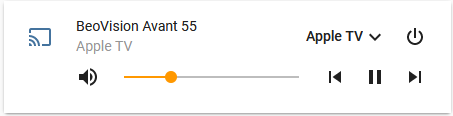

# BeoPlay: Bang & Olufsen Speakers and TVs in Home Assistant

This component enables integration of B&O Audio/Video equipment with Home Assistant and specifically TVs, Speakers and units like the BeoLink Converter ML/NL. 

## Installation

Installation for the moment is through custom_components. Just copy the full contents of the `custom_components/beoplay` folder into the `config/custom_components/beoplay` folder in your Home Assistant system (You'll need to create the beoplay folder. If you are installing over a previous version, delete all the contents and start fresh). Then, restart Home Assistant.

Configuration is very simple, go to Configuration -> Integrations -> Add Integration (bottom right corner), search for BeoPlay and insert the host name or IP.

It should work with both TVs, Speakers and other devices like NL/ML converters.

The component also works with Zeroconf, so B&amp;O devices should automaticlly show up in your discovery panel (Configuration->Integrations)


It should show up as something like this:



## Services

The integration is a Media Player so responds to all Media Player commands.

It also exposes 2 additional services:

```
beoplay_join_experience:
  description: "Join Experience."
  fields:
    entity_id:
      description: "A media player Entity ID."
      example: "media_player.my_chromecast"
beoplay_leave_experience:
  description: "Leave Experience."
  fields:
    entity_id:
      description: "A media player Entity ID."
      example: "media_player.my_chromecast"
```

You can use them to have the speaker join and leave an existing play experience, just like pressing the 'Join' button on the remote. A source must be playing already for Join to work.

These are called through service calls, e.g.:


## Events

Beoplay also generates events (`beoplay_notification`) where you can track status changes of the speaker. You can use this to enable all kinds of cool experiences (e.g., catch buttons like `A.MEM` to control automations on the Home Assistant like starting a streaming player)


